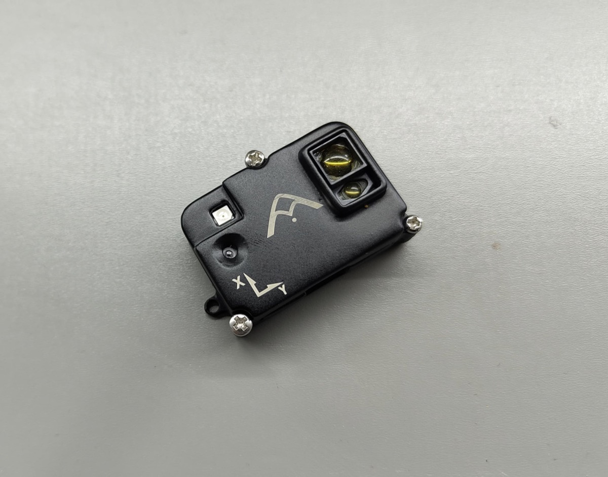

# Agam FloRange

::: warning
PX4 does not manufacture this (or any) autopilot component.
Contact the [manufacturer](https://www.agamrobotics.com/) for hardware support or compliance issues.
:::

Agam FloRange is [Agam Robotics'](https://www.agamrobotics.com/) [DroneCAN](index.md) [optical flow](../sensor/optical_flow.md), [distance sensor](../sensor/rangefinders.md), and IMU module. Its primary use is to provide local positioning in the absence of global positioning devices such as GNSS modules.

It builds on its own PX4 target, [`boards/agam/florange`](https://github.com/agam-robotics/PX4-Autopilot).

## Where to Buy

Order this module from:

- [Agam Robotics](https://www.agamrobotics.com/product-page/agam-florange-sensor)

## Hardware Specifications

- Sensors
  - PixArt PAA3905E1 Optical Flow Sensor
    - Wide working distance from 80mm to infinity, no calibration required
    - Supports synchronized multi-chip operation and automatic mode switching
  - Broadcom AFBR-S50LV85D Time-of-Flight Distance Sensor
    - Integrated 850 nm laser light source
    - Field-of-View (FoV) of 12.4° x 6.2° with 32 pixels
    - Typical distance range up to 30m
    - Operation of up to 200k Lux ambient light
  - InvenSense ICM-42688-P 6-Axis IMU
  - IR LED for low-light operation
- CAN interface
- Debug port
- Small Form Factor: 44.95mm x 29.4mm x 15.59mm
- Weight: 9.38g (including enclosure)

## Hardware Setup

### Wiring

Connect Agam FloRange to the autopilot's CAN bus.
For more information, refer to the [CAN Wiring](../can/index.md#wiring) instructions.

### Orientation

For optical flow, the default mounting orientation is with the connectors pointing towards the **back of the vehicle**, corresponding to the default value (`0`) of [SENS_FLOW_ROT](../advanced_config/parameter_reference.md#SENS_FLOW_ROT).
Change this parameter if mounting with a different yaw rotation.

The distance sensor can be pointed independently of the flow sensor's mounting, since [SENS_AFBR_ROT](../advanced_config/parameter_reference.md#SENS_AFBR_ROT) is set separately (for example, downward for terrain-relative flow/altitude, or forward for collision prevention).
When mounted anywhere other than downward, the unit's optical flow output no longer corresponds to ground-relative motion and should not be enabled ([UAVCAN_SUB_FLOW](../advanced_config/parameter_reference.md#UAVCAN_SUB_FLOW)) for that unit.

If running more than one Agam FloRange unit on the same bus with different mountings, set each unit's own `SENS_AFBR_ROT` — see [Node ID Allocation](index.md#node-id-allocation) for how to tell identical units apart before configuring them individually via [QGC's CAN node parameter view](index.md#qgc-cannode-parameter-configuration).

## Firmware Setup

Agam FloRange runs the [PX4 DroneCAN Firmware](px4_cannode_fw.md).
It supports firmware updates over the CAN bus and [dynamic node allocation](index.md#node-id-allocation). Firmware updates are also possible over SWD provided by the 6-pin JST SH serial port.

- Firmware target: `agam_florange_default`
- Bootloader target: `agam_florange_canbootloader`

## Flight Controller Setup

### Enable DroneCAN

The steps are:

- In _QGroundControl_ set the parameter [UAVCAN_ENABLE](../advanced_config/parameter_reference.md#UAVCAN_ENABLE) to `2` for dynamic node allocation (or `3` if also using [DroneCAN ESCs](../dronecan/escs.md)) and reboot (see [Finding/Updating Parameters](../advanced_config/parameters.md)).
- Connect Agam FloRange's CAN to the autopilot's CAN bus.

Once enabled, the module will be detected on boot.

DroneCAN configuration in PX4 is explained in more detail in [DroneCAN > Enabling DroneCAN](index.md#enabling-dronecan).

### PX4 Configuration

Set the following parameters in _QGroundControl_, depending on which functions of the module you use:

- Enable optical flow fusion by setting [EKF2_OF_CTRL](../advanced_config/parameter_reference.md#EKF2_OF_CTRL).
- To optionally disable GPS aiding, set [EKF2_GPS_CTRL](../advanced_config/parameter_reference.md#EKF2_GPS_CTRL) to `0`.
- Enable [UAVCAN_SUB_FLOW](../advanced_config/parameter_reference.md#UAVCAN_SUB_FLOW).
- Enable [UAVCAN_SUB_RNG](../advanced_config/parameter_reference.md#UAVCAN_SUB_RNG).
- Set [UAVCAN_RNG_MIN](../advanced_config/parameter_reference.md#UAVCAN_RNG_MIN) and [UAVCAN_RNG_MAX](../advanced_config/parameter_reference.md#UAVCAN_RNG_MAX) to the sensor's valid range.
- If using the distance sensor for height aiding, set [EKF2_RNG_CTRL](../advanced_config/parameter_reference.md#EKF2_RNG_CTRL), [EKF2_RNG_A_HMAX](../advanced_config/parameter_reference.md#EKF2_RNG_A_HMAX) and [EKF2_RNG_QLTY_T](../advanced_config/parameter_reference.md#EKF2_RNG_QLTY_T) as needed for your application.
- [UAVCAN_RNG_ROT](../advanced_config/parameter_reference.md#UAVCAN_RNG_ROT) only matters if a unit is not reporting its own orientation; with Agam FloRange it can be left at its default.
- Set [SENS_FLOW_MINHGT](../advanced_config/parameter_reference.md#SENS_FLOW_MINHGT) and [SENS_FLOW_MAXHGT](../advanced_config/parameter_reference.md#SENS_FLOW_MAXHGT), the minimum and maximum height of the flow sensor.
- Set [SENS_FLOW_MAXR](../advanced_config/parameter_reference.md#SENS_FLOW_MAXR) to `7.4` to match the PAA3905 maximum angular flow rate.
- The parameters [EKF2_OF_POS_X](../advanced_config/parameter_reference.md#EKF2_OF_POS_X), [EKF2_OF_POS_Y](../advanced_config/parameter_reference.md#EKF2_OF_POS_Y) and [EKF2_OF_POS_Z](../advanced_config/parameter_reference.md#EKF2_OF_POS_Z) can be set to account for the offset of the module from the vehicle centre of gravity.

When optical flow is the only source of horizontal position/velocity, lowering the gain for controller response to horizontal position error [MPC_XY_P](../advanced_config/parameter_reference.md#MPC_XY_P) (e.g. to 0.5) is recommended to reduce oscillations.

### Collision Prevention

A unit mounted facing outward (for example, forward) can be used with PX4's [Collision Prevention](../computer_vision/collision_prevention.md) feature to automatically slow or stop the vehicle before it reaches an obstacle.

- Set that unit's [SENS_AFBR_ROT](../advanced_config/parameter_reference.md#SENS_AFBR_ROT) to match its mounted direction (for example, `0` for forward-facing).
  The flight controller reads the orientation from the unit itself, so no separate FC-side orientation setting is needed for it.
- Enable [UAVCAN_SUB_RNG](../advanced_config/parameter_reference.md#UAVCAN_SUB_RNG) and set [UAVCAN_RNG_MIN](../advanced_config/parameter_reference.md#UAVCAN_RNG_MIN)/[UAVCAN_RNG_MAX](../advanced_config/parameter_reference.md#UAVCAN_RNG_MAX) as above.
- Set [CP_DIST](../advanced_config/parameter_reference.md#CP_DIST) to the minimum distance the vehicle should keep from obstacles, and [MPC_POS_MODE](../advanced_config/parameter_reference.md#MPC_POS_MODE) to `Acceleration based`.
- See [Collision Prevention](../computer_vision/collision_prevention.md) for the remaining parameters ([CP_DELAY](../advanced_config/parameter_reference.md#CP_DELAY), [CP_GUIDE_ANG](../advanced_config/parameter_reference.md#CP_GUIDE_ANG), [CP_GO_NO_DATA](../advanced_config/parameter_reference.md#CP_GO_NO_DATA)) and how the vehicle behaves once it is active.

Multiple units at different mountings are supported on the same vehicle — for example, one forward-facing for collision prevention and one downward-facing for flow-based position hold — since each reports its own orientation independently (see [Orientation](#orientation) above).

## Agam FloRange Configuration

On the module, you may need to configure the following parameters:

| Parameter                                                                                                 | Description                                                                                                                           |
| ---------------------------------------------------------------------------------------------------------- | --------------------------------------------------------------------------------------------------------------------------------------- |
| [CANNODE_NODE_ID](../advanced_config/parameter_reference.md#CANNODE_NODE_ID)   | CAN node ID (0 for dynamic allocation). If set to 0 (default), dynamic node allocation is used. Set to 1-125 to use a static node ID. |
| [CANNODE_TERM](../advanced_config/parameter_reference.md#CANNODE_TERM)            | CAN built-in bus termination.                                                                                                          |
| [SENS_FLOW_ROT](../advanced_config/parameter_reference.md#SENS_FLOW_ROT)         | Yaw rotation of the optical flow sensor relative to the vehicle body frame.                                                            |
| [SENS_AFBR_ROT](../advanced_config/parameter_reference.md#SENS_AFBR_ROT)         | Mounting orientation of the distance sensor, set independently of `SENS_FLOW_ROT`.                                                     |

## See Also

- [DroneCAN > Node ID Allocation](index.md#node-id-allocation)
- [PX4 DroneCAN Firmware](px4_cannode_fw.md)
