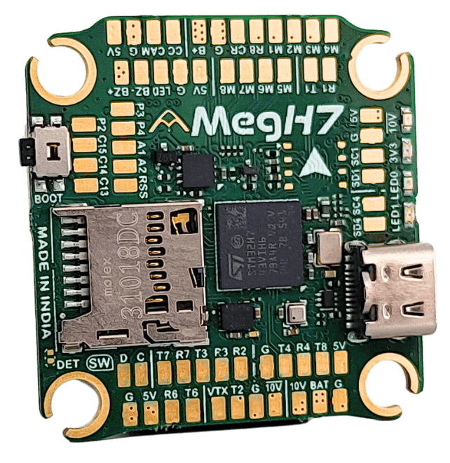

# Agam MegH7

::: warning
PX4 does not manufacture this (or any) autopilot.
Contact the [manufacturer](https://www.agamrobotics.com/) for hardware support or compliance issues.
:::

The [Agam MegH7](https://www.agamrobotics.com/agammegh7) is an STM32H743 flight controller in a 30.5 x 30.5mm form factor, with an onboard IMU, barometer, analog OSD, full-size microSD slot, CAN bus and seven UARTs.
This page describes hardware revision v1.2.

The board has no internal magnetometer, and provides two external I2C buses for a GPS/compass module or other peripherals.



::: info
This flight controller is [manufacturer supported](../flight_controller/autopilot_manufacturer_supported.md).
:::

## Key Features

- MCU: STM32H743 32-bit processor running at 480 MHz
- IMU: ICM-45686
- Barometer: BMP390
- OSD: AT7456E
- 7x UARTs (1, 2, 3, 4, 6, 7, 8)
- 1x CAN
- 2x external I2C buses
- 9x PWM outputs (8 motor outputs, 1 LED)
- Full-size microSD card slot for logging
- Optional onboard W25Q128 SPI flash (assembly option, not fitted on every board)
- 1x JST-SH 1.0mm 8-pin ESC port (single or 4-in-1 ESCs, x8/octocopter compatible)
- 1x JST-SH 1.0mm 6-pin port for HD video systems such as Caddx Vista and DJI Air Unit
- Battery input voltage: 2S-8S
- BEC 5V 3A cont.
- BEC 10V 3A cont.
- Mounting: 30.5 x 30.5mm/Φ4mm holes with Φ3mm grommets
- Dimensions: 37.5 x 39 x 8.8mm
- Weight: 10g

## Where to Buy {#store}

The board can be bought from:

- [Agam Robotics](https://www.agamrobotics.com/shop)

## Connectors

The GPS, TELEM, CAN and RX connectors are JST-GH 1.25mm.
The ESC, DIGI VTX, SPI4, I2C4 and B/LD connectors are JST-SH 1.0mm.
Signal pins are 3.3V.

| Connector  | Type         | Function                                          |
| ---------- | ------------ | ------------------------------------------------- |
| USB Type-C |              | Firmware and configuration                        |
| microSD    |              | Logging                                           |
| ESC        | JST-SH 8-pin | Motor outputs, current sense, ESC telemetry       |
| GPS        | JST-GH 6-pin | GPS and I2C1                                      |
| TELEM      | JST-GH 6-pin | Telemetry, with flow control                      |
| RX         | JST-GH 4-pin | Serial RC input                                   |
| CAN        | JST-GH 4-pin | CAN bus                                           |
| DIGI VTX   | JST-SH 6-pin | HD video system, with 10V supply                  |
| SPI4       | JST-SH 8-pin | External SPI, with interrupt and data-ready lines |
| I2C4       | JST-SH 4-pin | External I2C                                      |
| B/LD       | JST-SH 4-pin | Buzzer and addressable LED strip                  |

The same signals are also broken out as solder pads on the bottom of the board, along with the analog camera and VTX pads, the analog inputs `RSSI`, `A1` and `A2`, and the spare user IO pads `C13`, `C14` and `C15`.

::: info
The buzzer and LED strip outputs are powered from the 5V BEC, so neither is active when the board is powered from USB alone.
:::

<a id="bootloader"></a>

## PX4 Bootloader Update

The board ships with a non-PX4 firmware pre-installed.
Before PX4 firmware can be installed, the _PX4 bootloader_ must be flashed.
Download the [agam-robotics_megh7_bootloader.bin](https://github.com/PX4/PX4-Autopilot/raw/main/boards/agam-robotics/megh7/extras/agam-robotics_megh7_bootloader.bin) bootloader binary and read [this page](../advanced_config/bootloader_update_from_betaflight.md) for flashing instructions.

## Building Firmware

To [build PX4](../dev_setup/building_px4.md) for this target:

```sh
make agam-robotics_megh7_default
```

## Installing PX4 Firmware

Firmware can be installed in any of the normal ways:

- Build and upload the source:

  ```sh
  make agam-robotics_megh7_default upload
  ```

- [Load the firmware](../config/firmware.md) using _QGroundControl_.
  You can use either pre-built firmware or your own custom firmware.

## PX4 Configuration

In addition to the [basic configuration](../config/index.md), the following parameters are important:

| Parameter                                                            | Setting                                                                                                                 |
| -------------------------------------------------------------------- | ----------------------------------------------------------------------------------------------------------------------- |
| [SYS_HAS_MAG](../advanced_config/parameter_reference.md#SYS_HAS_MAG) | This should be disabled since the board does not have an internal mag. You can enable it if you attach an external mag. |

## Serial Port Mapping

| UART   | Device     | Port                        |
| ------ | ---------- | --------------------------- |
| USART1 | /dev/ttyS0 | GPS1 (GPS connector)        |
| USART2 | /dev/ttyS1 | TELEM2 (DIGI VTX connector) |
| USART3 | /dev/ttyS2 | TELEM3 (`T3` / `R3` pads)   |
| UART4  | /dev/ttyS3 | TELEM4 (`T4` / `R4` pads)   |
| USART6 | /dev/ttyS4 | RC input (RX connector)     |
| UART7  | /dev/ttyS5 | TELEM1, with flow control   |
| UART8  | /dev/ttyS6 | ESC telemetry (DShot)       |

## Further info

- [Agam MegH7 product page](https://www.agamrobotics.com/agammegh7)

## Debug Port

### System Console

There is no serial console on this board.
The [System Console](../debug/system_console.md) is reached over USB.

### SWD

The [SWD interface](../debug/swd_debug.md) (JTAG) pins are exposed as the two pads marked `D` and `C` beneath the boxed `SW` label on the bottom of the board:

- `SWDIO`: pad marked `D`
- `SWCLK`: pad marked `C`
- `GND`: as marked on board
- `VDD_3V3`: as marked on board
